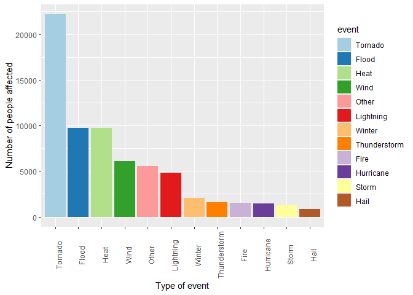
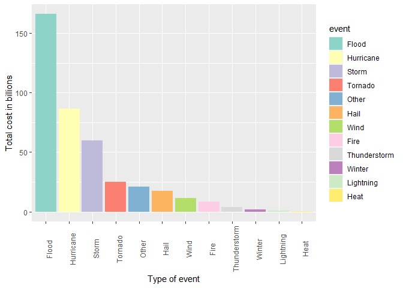

#### The following analysis was done in order to know which type of severe weather events were the most harmful with respect to population health and economic consequences across the United States from data collected by the the U.S. National Oceanic and Atmospheric Administration's (NOAA) storm database with events starting from the year 1950 and ending in 2011. We will see the chunks of code that were used to produce this entire analysis, the steps of how the data was processed, tidied and cleaned and in the end how were the plots done.

## Data Processing  

### Loading data  

The data was downloaded from the next link :  

* [Storm Data](https://d396qusza40orc.cloudfront.net/repdata%2Fdata%2FStormData.csv.bz2)


```r
if(!file.exists("repdata_data_StormData.csv.bz2")){
  link <- "https://d396qusza40orc.cloudfront.net/repdata%2Fdata%2FStormData.csv.bz2"
  download.file(link,
                destfile = "repdata_data_StormData.csv.bz2")
}
dataRAW <- read.csv("repdata_data_StormData.csv.bz2")
```
Let's take a look at the dimension of the data

```r
dim(dataRAW)
```

```
## [1] 902297     37
```
Wow! Almost a million of observations and 37 variables. Maybe we could remove some that are unnecesary.

There is also some documentation of the database available. Here you will find how some of the variables are constructed/defined.  

* National Weather Service [Storm Data Documentation](https://d396qusza40orc.cloudfront.net/repdata%2Fpeer2_doc%2Fpd01016005curr.pdf)

* National Climatic Data Center Storm Events [FAQ](https://d396qusza40orc.cloudfront.net/repdata%2Fpeer2_doc%2FNCDC%20Storm%20Events-FAQ%20Page.pdf)

### Subsetting data  
As we have seen before, there are a lot of variables so we are going to select only those that are necessary to our research questions:  

1. Across the United States, which types of events (as indicated in the **EVTYPE** variable) are most harmful with respect to population health? 

2. Across the United States, which types of events have the greatest economic consequences?  


```r
dataSub <- dataRAW[,c(1,2,8,23:28,37)]
names(dataSub) 
```

```
##  [1] "STATE__"    "BGN_DATE"   "EVTYPE"     "FATALITIES" "INJURIES"  
##  [6] "PROPDMG"    "PROPDMGEXP" "CROPDMG"    "CROPDMGEXP" "REFNUM"
```
Those are the variables that we need to do our research.  
Now we are going to filter from events from 1996 to present , because as we can see [here](https://www.ncdc.noaa.gov/stormevents/details.jsp?type=eventtype) , before 1996 there was only recordings from three types of events.  


```r
dataSub$BGN_DATE <- as.Date(dataSub$BGN_DATE,"%m/%d/%Y %H:%M:%S")
dataSub %<>% filter(BGN_DATE >= as.Date("1996-01-01"))
```
Because the topic of analysis is to adress which types of events are the most harmful with respect to population or economy, we can remove observations that dind't harm the population or the economy.  

```r
dataSub %<>% filter(FATALITIES!=0 | INJURIES != 0 | PROPDMG != 0 | CROPDMG != 0)
```

### Cleaning and tidying data  

#### Events  

At this moment we are going to rename the EVTYPE to group the same type of events , because a this moment we have ``222`` different type of events.


```r
dataSub$EVTYPE <- tolower(dataSub$EVTYPE)
dataSub$event <- "Other"
dataSub$event[grep("wind",dataSub$EVTYPE,ignore.case = T)] <- "Wind"
dataSub$event[grep("Hail",dataSub$EVTYPE,ignore.case = T)] <- "Hail"
dataSub$event[grep("Flood",dataSub$EVTYPE,ignore.case = T)] <- "Flood"
dataSub$event[grep("Tornado",dataSub$EVTYPE,ignore.case = T)] <- "Tornado"
dataSub$event[grep("Lightning",dataSub$EVTYPE,ignore.case = T)] <- "Lightning"
dataSub$event[grep("Storm",dataSub$EVTYPE,ignore.case = T)] <- "Storm" 
dataSub$event[grep("Thunderstorm",dataSub$EVTYPE,ignore.case = T)] <- "Thunderstorm"
dataSub$event[grep("Hurricane",dataSub$EVTYPE,ignore.case = T)] <- "Hurricane"
dataSub$event[grep("Heat",dataSub$EVTYPE,ignore.case = T)] <- "Heat"
dataSub$event[grep("Winter",dataSub$EVTYPE,ignore.case = T)] <- "Winter"
dataSub$event[grep("Fire",dataSub$EVTYPE,ignore.case = T)] <- "Fire"
```
Now we only have ``12`` type of events.  

#### Exponents
In the next chunk we are going to calculate the property and crop total damages. We have to calculate it with the ``PROPDMG, PROPDMGEXP, CROPDMG, CROPDMGEXP`` columns.

```r
exp <- union(unique(dataSub$CROPDMGEXP),unique(dataSub$PROPDMGEXP))
mult <- c(1000,1,10^6,10^9)
dataSub$CROPDMGEXP <- as.numeric( mapvalues(dataSub$CROPDMGEXP,exp,mult))
dataSub$PROPDMGEXP <- as.numeric( mapvalues(dataSub$PROPDMGEXP,exp,mult))
dataSub %<>% mutate(totaldmg = (PROPDMG*PROPDMGEXP+CROPDMG*CROPDMGEXP))
dataSub %<>% mutate (people = FATALITIES+INJURIES) 
```

## Results  


```r
dataPeople <- aggregate(people ~ event,data = dataSub, sum) 
dataPeople <- dataPeople[order(-dataPeople$people),]
dataPeople$event <- factor(dataPeople$event,levels = dataPeople$event)
p <- ggplot(dataPeople, aes(x=event,people,fill=event),group=1)
p + geom_bar(stat="identity") + 
  theme(axis.text.x = element_text(angle = 90)) +
  scale_fill_brewer(palette="Paired") + 
  xlab("Type of event") +
  ylab("Number of people affected")
```

<!-- -->

For the first question, as we can see in the plot, the top 3 events that were most harmful with respect to population health were ``Tornado, Flood, Heat`` .


```r
dataDamage <- aggregate(totaldmg ~ event,data = dataSub, sum) 
dataDamage <- dataDamage[order(-dataDamage$totaldmg),]
dataDamage$event <- factor(dataDamage$event,levels = dataDamage$event)
dataDamage$totaldmg <- dataDamage$totaldmg/10^9
p <- ggplot(dataDamage, aes(x=event,totaldmg,fill=event),group=1)
p + geom_bar(stat="identity") + 
  theme(axis.text.x = element_text(angle = 90)) +
  scale_fill_brewer(palette="Set3") + 
  xlab("Type of event") +
  ylab("Total cost in billions")
```

<!-- -->

For the second question, as we can see in the plot, the top 3 events that were most harmful with respect to population health were ``Flood, Hurricane, Storm`` with a cost in billions of dollars.


